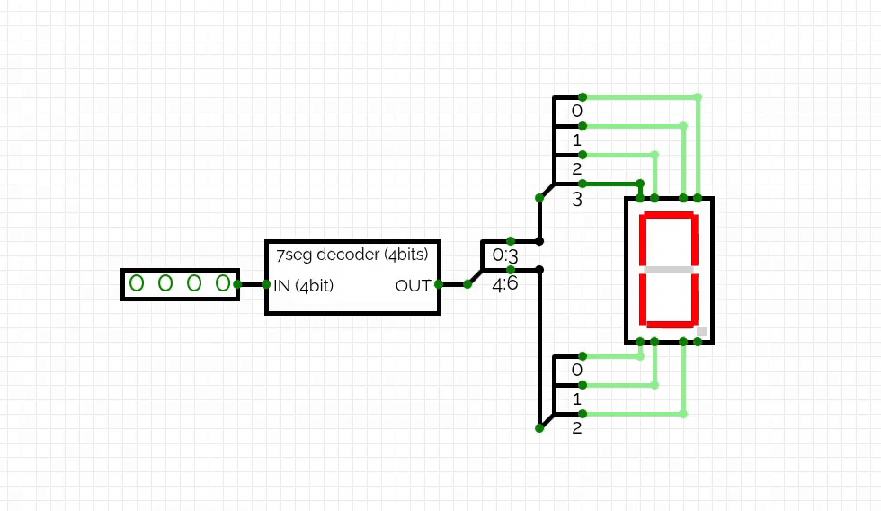

# 7-Segment Display Decoder

A 7-segment display decoder built and simulated using [CircuitVerse](https://circuitverse.org).

The decoder receives a 4-bit BCD input and converts it into the corresponding control signals for a 7-segment display. It can display decimal digits from `0` to `9`.

## Preview

## Circuit Simulation

The circuit was designed and simulated in CircuitVerse. You can view how it was built and try the decoder using the link below:

[Open the 7-segment decoder simulation](https://circuitverse.org/users/25835/projects/7segdecoder)
