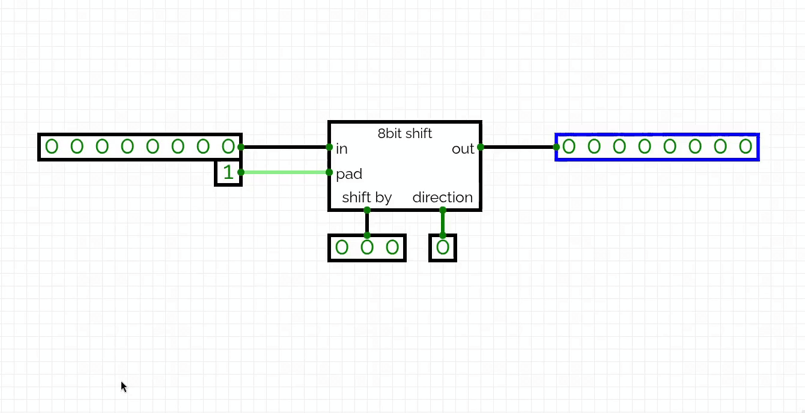

# 8-Bit Bidirectional Shift Register

An 8-bit bidirectional shift register built and simulated using [CircuitVerse](https://circuitverse.org).

The register stores an 8-bit binary value and can shift its contents either to the left or to the right. A selectable shift-in bit is inserted into the vacant position created by each shift. This allows the circuit to insert either `0` or `1` during the shifting operation.

## Preview

## Circuit Simulation

The circuit was designed and simulated in CircuitVerse. You can view how it was built and try the shift register using the link below:

[Open the 8-bit bidirectional shift register simulation](https://circuitverse.org/users/25835/projects/8bit-bidirectional-shift-register)
