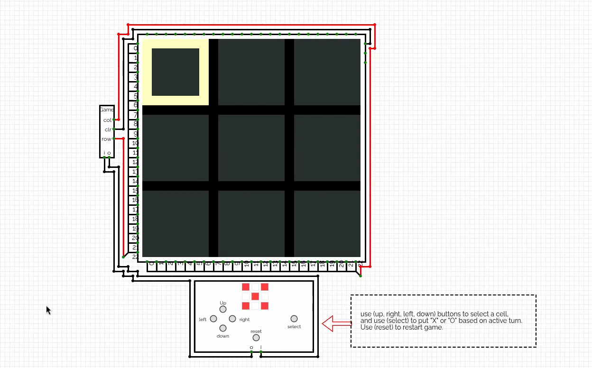

# Infinite Tic Tac Toe Game

A two-player infinite Tic-Tac-Toe game built and simulated using [CircuitVerse](https://circuitverse.org).

The game is played on a `24 x 24` pixel matrix. Players take turns placing their marks on the board. Each player can have a maximum of three active marks at any time. When a player places a new mark after already making three moves, their oldest mark is removed, allowing the game to continue indefinitely.

## Preview

## Circuit Simulation

The circuit was designed and simulated in CircuitVerse. You can view how it was built and try the game using the link below:

[Open the Infinite Tic-Tac-Toe simulation](https://circuitverse.org/users/25835/projects/infinite-tic-tac-toe-game).
