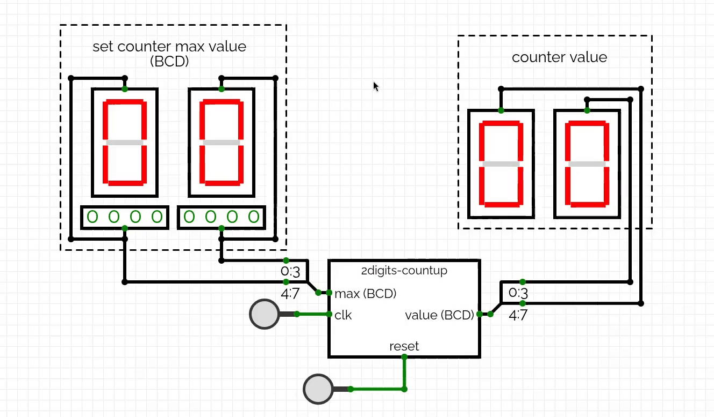

# Two-Digit BCD Counter Using JK Flip-Flops

A two-digit BCD counter built and simulated using [CircuitVerse](https://circuitverse.org).

The circuit is based on two 4-bit counters built from JK flip-flops. Each 4-bit counter represents one decimal BCD digit and counts from `0000` to `1001`, corresponding to decimal values `0` through `9`.

The units counter increments with every clock pulse. When it reaches `9`, it resets to `0` and generates a carry signal that increments the tens counter. The maximum count can be configured to any value from `00` to `99`. Once the configured maximum value is reached, the counter resets to `00`.

## Preview

## Circuit Simulation

The circuit was designed and simulated in CircuitVerse. You can view how it was built and try the counter using the link below:

[Open the Two-Digit BCD Counter simulation](https://circuitverse.org/users/25835/projects/2-digits-count-up)